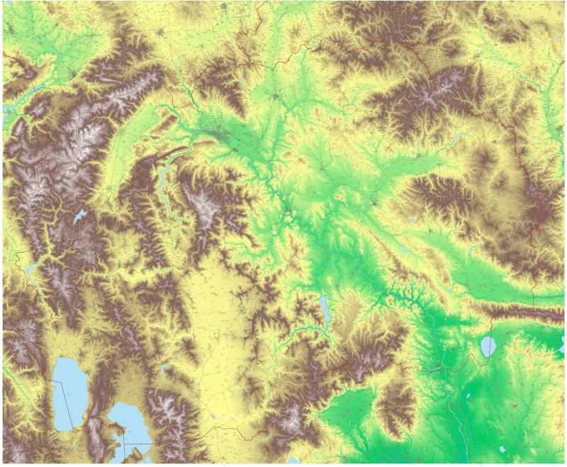
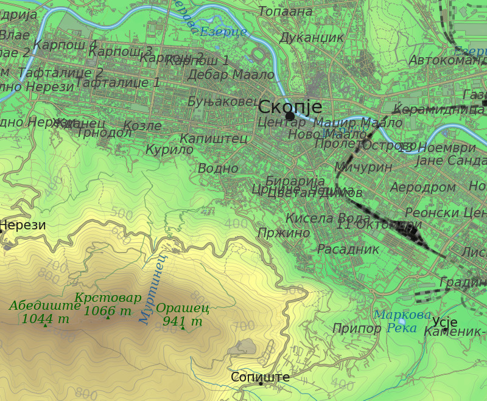

# 🗺️ Geographical Map Generator

This project allows you to generate detailed terrain maps with various geographical features like roads, rivers, buildings, and country boundaries. It fetches elevation data from a Terrarium dataset and geographical data from OpenStreetMap (OSM) to create visually rich maps. It generates a high-quality, print-ready file.

<table>
  <tr>
    <td></td>
    <td></td>
  </tr>
</table>

---

## 🚀 Getting Started

To run this project, you'll need Python and a few libraries.

### Prerequisites

Make sure you have Python 3.8 or newer installed. You can download it from [python.org](https://www.python.org/downloads/).

### Installation

1.  **Clone the repository** (if it's in a Git repository):
    ```bash
    git clone [https://github.com/mdimitri/elevationAnalysis.git](https://github.com/mdimitri/elevationAnalysis.git)
    cd elevationAnalysis
    ```
    If not, just make sure both `mapSelector.py` and `makeMap_epsg4326.py` are in the same directory.

2.  **Install the required Python libraries**:
    Open your terminal or command prompt and run:
    ```bash
    pip install requests pillow numpy matplotlib geopandas pandas shapely rasterio pyproj tqdm scikit-image osm2geojson geodatasets pyperclip
    ```

---

## 📂 Project Structure

* `mapSelector.py`: This is a new graphical user interface (GUI) script. It allows you to visually select a geographical area on a base map and download the corresponding elevation data as a `.npz` file.
* `makeMap_epsg4326.py`: This is the main map generation script. It takes the elevation data generated by `mapSelector.py`, fetches various geographical features from OpenStreetMap, and then uses Matplotlib to render a detailed map. It can also cache fetched data to speed up subsequent runs.

---

## 🏃 How to Use

### Step 1: Get Elevation Data

First, use the `mapSelector.py` GUI to download the terrain heightmap for your desired area.

1.  Open your terminal or command prompt and run:
    ```bash
    python mapSelector.py
    ```
2.  A new window will appear with a world map. Click and drag to select your desired geographical area.
3.  When you release the mouse, a popup will ask for confirmation to download the tiles. Click "Yes".
4.  Once the download is complete, the script will save the elevation data as a `.npz` file in the `heightmap_data` directory. The filename will be automatically copied to your clipboard.

### Step 2: Generate the Map

Now that you have the elevation data, you can generate the detailed map.

1.  Open `makeMap_epsg4326.py` in a text editor.
2.  In the `main()` function, find the `rasterPath` variable.
3.  Change the value of `rasterPath` to the path of the `.npz` file you downloaded in Step 1.
4.  (Optional) You can also adjust the following variables in the `main()` function to customize your map:
    * `dpi`: The resolution of the output image in dots per inch.
    * `resolutionFactor`: A factor to scale the output resolution.
    * `resolution`: Controls the detail of geographical features.
    * `subsample`: A number to subsample the elevation data for faster rendering.
    * `exagerateTerrain`: Set to `True` for hill shading to create a 3D effect.
5.  Save the file and run it from your terminal or command prompt:
    ```bash
    python makeMap_epsg4326.py
    ```
6.  The script will generate a PNG file of your map in the current directory.

---

## 🤝 Contributing

Contributions are welcome! Feel free to fork the project, open issues, or submit pull requests with improvements!

---

## 📄 License

### MIT License

Copyright (c) [2025] [Geographical Map Generator]

Permission is hereby granted, free of charge, to any person obtaining a copy
of this software and associated documentation files (the "Software"), to deal
in the Software without restriction, including without limitation the rights
to use, copy, modify, merge, publish, distribute, sublicense, and/or sell
copies of the Software, and to permit persons to whom the Software is
furnished to do so, subject to the following conditions:

The above copyright notice and this permission notice shall be included in all
copies or substantial portions of the Software.

THE SOFTWARE IS PROVIDED "AS IS", WITHOUT WARRANTY OF ANY KIND, EXPRESS OR
IMPLIED, INCLUDING BUT NOT LIMITED TO THE WARRANTIES OF MERCHANTABILITY,
FITNESS FOR A PARTICULAR PURPOSE AND NONINFRINGEMENT. IN NO EVENT SHALL THE
AUTHORS OR COPYRIGHT HOLDERS BE LIABLE FOR ANY CLAIM, DAMAGES OR OTHER
LIABILITY, WHETHER IN AN ACTION OF CONTRACT, TORT OR OTHERWISE, ARISING FROM,
OUT OF OR IN CONNECTION WITH THE SOFTWARE OR THE USE OR OTHER DEALINGS IN THE
SOFTWARE.

---

## 🙏 Acknowledgements

* **Terrarium Tiles**: For providing global elevation data.
* **OpenStreetMap (OSM)**: For the rich geographical feature data.
* **Matplotlib**: For plotting and visualization.
* **GeoPandas, Shapely, rasterio, pyproj, osm2geojson**: For geospatial data handling.